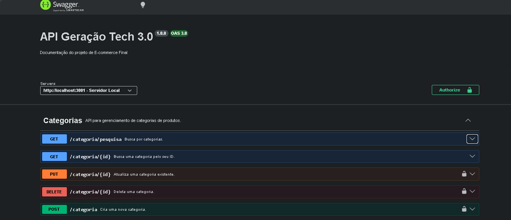
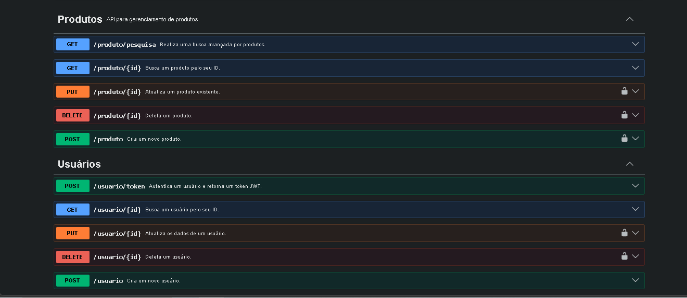
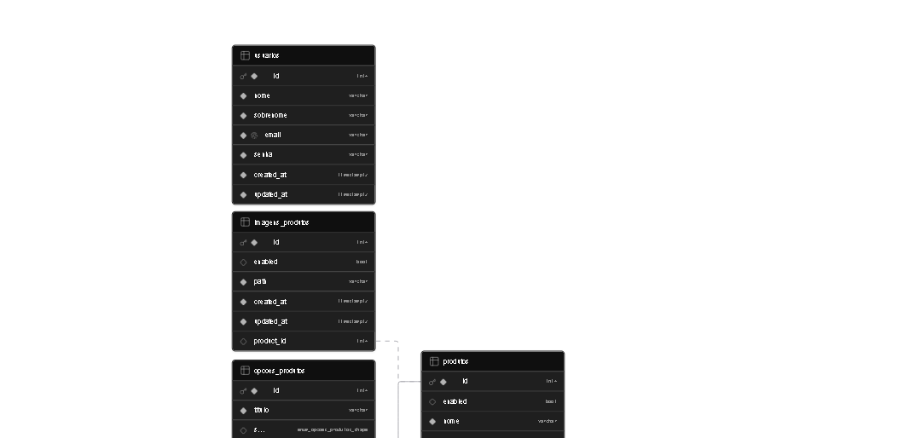

# 🚀 E-commerce API - Geração Tech 3.0
Esta é a API REST de um E-commerce completo, desenvolvida como projeto final para o curso Fullstack Geração Tech 3.0. A aplicação simula o backend de uma loja virtual, permitindo o gerenciamento de usuários, categorias, produtos, imagens e opções de variações.

## 🛠️ Tecnologias e Ferramentas
Node.js & Express (Servidor e Rotas)

Sequelize ORM (Mapeamento de dados)

PostgreSQL (Banco de dados hospedado no Supabase)

JWT (JSON Web Token) (Autenticação de rotas protegidas)

Swagger (OpenAPI 3.0) (Documentação interativa)

CORS (Segurança para acesso do Frontend)

## 📌 Funcionalidades Principais
Gestão de Usuários: Cadastro e geração de Token JWT para acesso administrativo.

Gestão de Produtos: CRUD completo com suporte a múltiplas imagens (Base64) e opções (tamanho, cor, etc.).

Categorização: Organização de produtos por categorias vinculadas.

Segurança: Middlewares que exigem Token Bearer para rotas de criação, edição e deleção.

Documentação: Interface Swagger completa para testes de endpoints.

## 📸 Demonstração do Projeto
Esta seção exibe o funcionamento da API através da documentação Swagger e da estrutura do banco de dados no Supabase.



Esquema no Supabase:



## 📂 Como Configurar o Projeto
1. Clonar e Instalar
```
git clone https://github.com/EllonMagno88/project-root.git
cd project-root
npm install
```
2. Configuração do Banco de Dados (.env)
Crie um arquivo .env baseado no exemplo abaixo para conectar ao seu Supabase (lembre-se de usar a porta 5432 para conexão direta):
```
PORT=3001
JWT_SECRET=seu_segredo_aqui
JWT_EXPIRES_IN=1d

DB_HOST=db.seu_id_projeto.supabase.co
DB_USER=postgres
DB_PASSWORD=sua_senha_supabase
DB_NAME=postgres
DB_PORT=5432
DB_DIALECT=postgres

```
3. Executando
```
# Para desenvolvimento (com nodemon)
npm run dev

# Para produção
npm start
```

## 📖 Documentação dos Endpoints
A API utiliza o prefixo /nome-da-rota para todas as rotas. Após iniciar o servidor, acesse a documentação interativa em:
http://localhost:3001/api-docs

Exemplo de Fluxo de Teste:
Crie um usuário em POST /usuario.

Faça login em POST /usuario/token e copie o token.

No Swagger, clique em Authorize e cole o token.

Agora você está liberado para criar produtos em POST /produto.

```
project-root/
├── src/
│   ├── config/      # Configuração do Sequelize e DB
│   ├── controllers/ # Lógica de negócio (Users, Products, Categories)
│   ├── database/    # Migrations e Models (Sequelize)
│   ├── middleware/  # Filtros de segurança (Auth)
│   ├── models/      # Definição das tabelas
│   ├── routes/      # Definição dos endpoints (/v1)
│   └── app.js       # Configuração do Express e Swagger
└── server.js        # Inicialização do servidor
```

## 🎓 Sobre o Projeto
Este projeto foi desenvolvido por Ellon Magno Nogueira Bezerra como critério de avaliação final do curso Geração Tech 3.0. O objetivo foi aplicar conhecimentos de arquitetura MVC, banco de dados relacionais e segurança em APIs Node.js.
